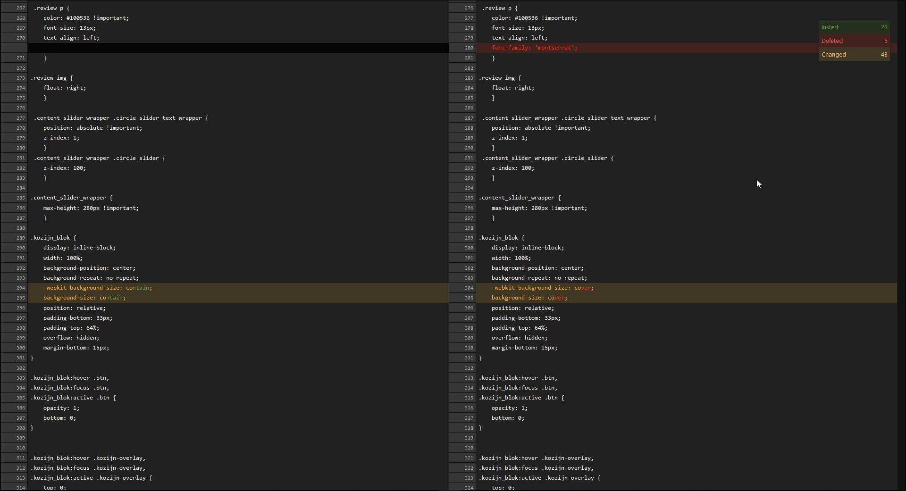
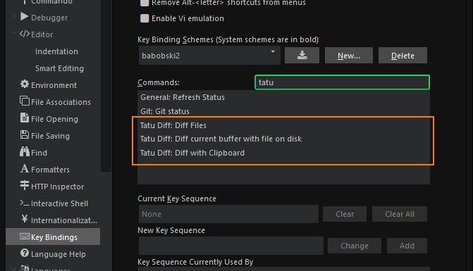
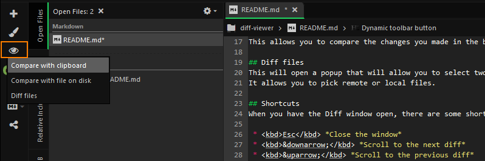

Tatu diff is a advanced diff viewer,  
it allows to view various diffs side by side.

The main features of Tatu Diff are:

 * Compare with clipboard
 * Compare with file on disk
 * Compare files
 

 
## Compare with clipboard
Compare current buffer, with clipboard content.  
This function allows you to easily compare the content of you're clipboard, with the buffer of you're current file.  
This allows you to easily compare between files.

## Compare with file on disk
Compare the buffer of the current file, with the file on disk.  
This allows you to compare the changes you made in the buffer, with the current file.

## Diff files
This will open a popup that will allow you to select two different files for comparison.  
It allows you to pick remote or local files.

## Shortcuts
When you have the Diff window open, there are some shortcuts you can use.

 * <kbd>Esc</kbd> *Close the window* 
 * <kbd>&downarrow;</kbd> *Scroll to the next diff*  
 * <kbd>&uparrow;</kbd> *Scroll to the previous diff*
 * <kbd>Shift</kbd> + mouse click *Select multiple lines*
 * <kbd>Ctrl</kbd> + <kbd>c</kbd> or for mac users <kbd>&#8984;</kbd> + <kbd>c</kbd> *Copy selected lines from the left diff*

## Key bindings
For the Tatu diff are 3 key bindings available:

## Dynamic toolbar button
The actions for the Tatu Diff are also available as a dynamic toolbar button.

*In memorial of Tatu 2000 - 2018*